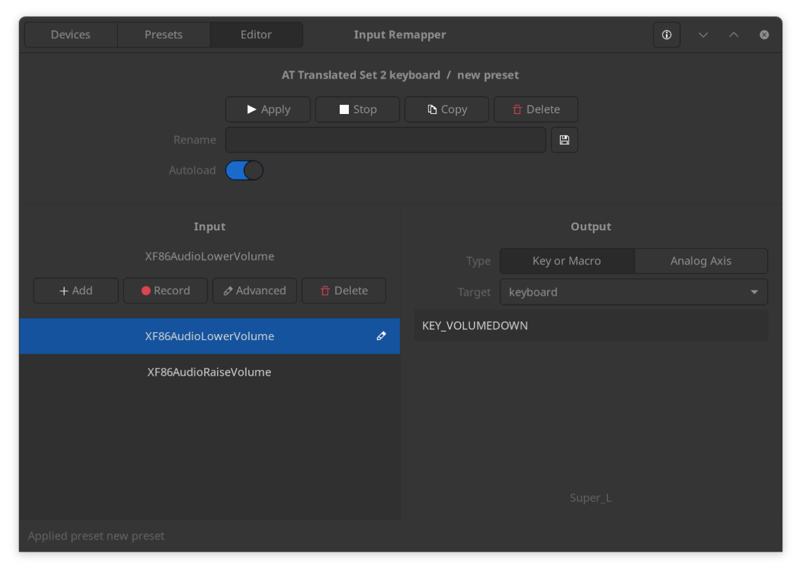

Awesome Minisforum V3
=====================

Useful (unofficial) information for [Minisforum V3 AMD Tablet](https://www.minisforum.com/page/v3/index.html?lang=en) users.

## Reviews

- [Minisforum V3 3-in-1 review: the first ever Windows tablet with AMD's Hawk Point APU aka the AMD Ryzen 7 8840U](https://www.notebookcheck.net/Minisforum-V3-3-in-1-review-the-first-ever-Windows-tablet-with-AMD-s-Hawk-Point-APU-aka-the-AMD-Ryzen-7-8840U.829081.0.html) by Notebookcheck
- [A Brief Review of the Minisforum V3 AMD Tablet](https://mudkip.me/2024/04/14/A-Brief-Review-of-the-Minisforum-V3-AMD-Tablet/) by Mudkip

## Videos

- [MinisForum V3 vs. Surface Pro 10 - Which Tablet is Better? Comprehensive.](https://www.youtube.com/watch?v=reh_iWrlJV8) by cbutters Tech
- [Minisforum V3 Tablet (AMD R7 8840U) Review: Tweaking Guide, Benchmarks, Hawk Point Testing](https://www.youtube.com/watch?v=ivm78Qyls3A) by Moore's Law Is Dead
- [Android + SteamOS on a Tablet! Minisforum V3 Quick Impressions (feat. Bazzite OS)](https://www.youtube.com/watch?v=MrlnZXNTvtM) by Aru
- [Tablet PCs are Kind of Amazing [MinisForum V3 Review]](https://www.youtube.com/watch?v=8P0G-JLeZD4) by Retro Game Corps
- [Minisforum V3 FULL Walkthrough. Ryzen 7 8840U Windows 11 Pro Tablet](https://www.youtube.com/watch?v=c_zbxrHhtQA) by TechTablets

## Resources

- [Drivers and Firmware Update](https://www.minisforum.com/new/support?lang=en#/support/page/download/120)
- [Minisforum Discord Server](https://discord.com/invite/Pxrg8WpFCa)
- [RyzenAdj](https://github.com/FlyGoat/RyzenAdj): Adjust power management settings.

## Guide for Windows Users

### Enable integer scaling

Run [Embeded_Integer_Scaling_On.reg](scripts/Embeded_Integer_Scaling_On.reg) and reboot Windows. Then enable integer scaling in *Display* in *AMD Software: Adrenalin Edition*. _Credits to Wobble._

## Guide for Linux Users

### Workaround for volume buttons not working when the keyboard is detached

Install [Input Remapper](https://github.com/sezanzeb/input-remapper) and configure like the screenshot below. _Credits to Aru._

### Workaround for global volume control with the speaker

Download [alsa-soft-mixer.conf](scripts/alsa-soft-mixer.conf) and move it to `~/.config/wireplumber/wireplumber.conf.d/alsa-soft-mixer.conf`, then reboot. _Credits to Aru._

### Manual rotation script

Download [rotateButton.sh](scripts/rotateButton.sh).  _Credits to Briar._

## Known Issues

- Enabling AMD Fluid Motion Frames in *AMD Software: Adrenalin Edition* may cause Windows to reboot.
- Automatic rotation and accelerometers doesn't work in Linux.