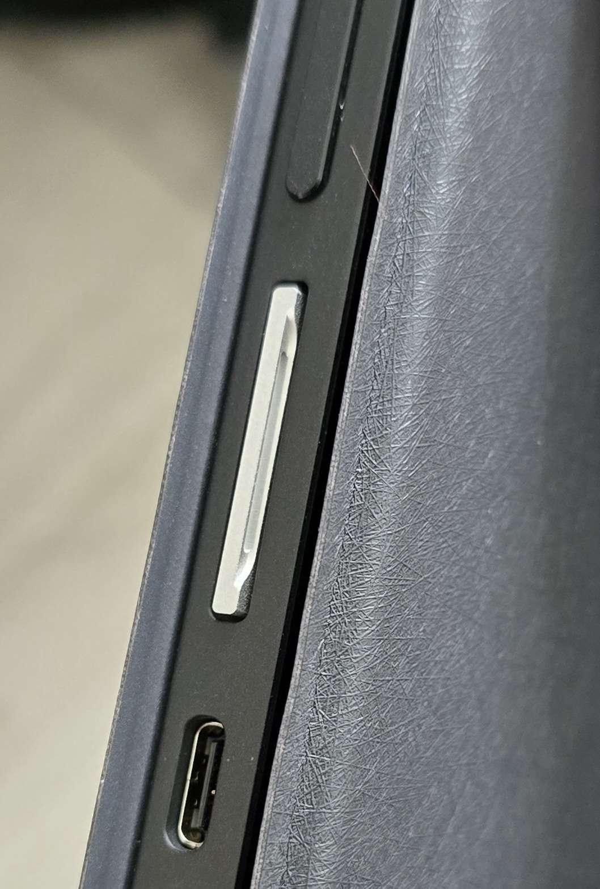

Awesome Minisforum V3
=====================

Useful (unofficial) information for [Minisforum V3 AMD Tablet](https://www.minisforum.com/page/v3/index.html?lang=en) users.

## Reviews

- [Minisforum V3 3-in-1 review: the first ever Windows tablet with AMD's Hawk Point APU aka the AMD Ryzen 7 8840U](https://www.notebookcheck.net/Minisforum-V3-3-in-1-review-the-first-ever-Windows-tablet-with-AMD-s-Hawk-Point-APU-aka-the-AMD-Ryzen-7-8840U.829081.0.html) by Notebookcheck
- [A Brief Review of the Minisforum V3 AMD Tablet](https://mudkip.me/2024/04/14/A-Brief-Review-of-the-Minisforum-V3-AMD-Tablet/) by Mudkip
- [Minisforum V3 Tablet - hardware compatibility report](https://www.reddit.com/r/linuxhardware/s/rQ7BrCkx4w) by Tsuki4735

## Videos

- [MinisForum V3 vs. Surface Pro 10 - Which Tablet is Better? Comprehensive.](https://www.youtube.com/watch?v=reh_iWrlJV8) by cbutters Tech
- [Minisforum V3 Tablet (AMD R7 8840U) Review: Tweaking Guide, Benchmarks, Hawk Point Testing](https://www.youtube.com/watch?v=ivm78Qyls3A) by Moore's Law Is Dead
- [Android + SteamOS on a Tablet! Minisforum V3 Quick Impressions (feat. Bazzite OS)](https://www.youtube.com/watch?v=MrlnZXNTvtM) by Aru
- [Tablet PCs are Kind of Amazing [MinisForum V3 Review]](https://www.youtube.com/watch?v=8P0G-JLeZD4) by Retro Game Corps
- [Minisforum V3 FULL Walkthrough. Ryzen 7 8840U Windows 11 Pro Tablet](https://www.youtube.com/watch?v=c_zbxrHhtQA) by TechTablets
- [It's a THICK tablet and I'm kinda into that - Minisforum V3](https://www.youtube.com/watch?v=kI_Y231zwoU) by ShortCircuit (Linus Tech Tips)

## Resources

- [Drivers and Firmware Update](https://www.minisforum.com/new/support?lang=en#/support/page/download/120)
- [Minisforum Discord Server](https://discord.com/invite/Pxrg8WpFCa)
- [RyzenAdj](https://github.com/FlyGoat/RyzenAdj): Adjust power management settings.

## Guide for Windows Users

### V3 Adj

A kludge of scripts with [RefreshRateSwitcher](https://github.com/sryze/RefreshRateSwitcher) and [RyzenAdj](https://github.com/FlyGoat/RyzenAdj) to control power limits along with auto setting brightness and refresh at startup and when the unit is swapped between AC power and Battery.

Extract [V3Adj.zip](https://github.com/mudkipme/awesome-minisforum-v3/blob/main/scripts/V3Adj.zip) to c:\ and run V3 Adj task install.bat as admin to install. 

Defaults to 37w and 9.5w for AC and Battery.
Edit values in V3_PowerSwap.bat to set your own limits.

***NOTE YOU NEED TO SET THE BIOS PROFILE TO 54W TO BEABLE TO INCREASE CURRENT LIMITS***

### CRU profile to expand VRR range down to 36Hz

CRU V3 Profile.zip is [Custom Resolution Utility](https://www.monitortests.com/forum/Thread-Custom-Resolution-Utility-CRU) By ToastyX and a profile made for the V3 Tablet that extends the VRR range.

Extract [CRU V3 Profile.zip](https://github.com/mudkipme/awesome-minisforum-v3/blob/main/scripts/Cru%20V3%20Profile.zip) and run cru and import the v3 36 to 165.bin file and restart the display driver with restart64.exe or just reboot the machine.

### Enable integer scaling

Run [Embeded_Integer_Scaling_On.reg](scripts/Embeded_Integer_Scaling_On.reg) and reboot Windows. Then enable integer scaling in *Display* in *AMD Software: Adrenalin Edition*. _Credits to Wobble._

## Guide for Linux Users

### Automatic rotation and accelerometers

See https://github.com/mudkipme/awesome-minisforum-v3/issues/2#issuecomment-2279282784.

### Fix volume buttons not working when the keyboard is detached

**Update: [libinput](https://gitlab.freedesktop.org/libinput/libinput/-/releases/1.26.2) 1.26.2 is released with quirks for Minisforum V3. If you are using Arch-based distributions or Fedora 40, you don't need to do this manually.** 

Quick install:

```bash
curl -L https://raw.githubusercontent.com/mudkipme/awesome-minisforum-v3/main/scripts/linux_fix_sound.sh | sudo sh
```

Manual Install:

Create `/etc/libinput/local-overrides.quirks` with the following content:
```ini
[Minisforum V3 volume keys]
MatchName=AT Translated Set 2 keyboard
MatchDMIModalias=dmi:*svnMicroComputer(HK)TechLimited:pnV3:*
ModelTabletModeNoSuspend=1
```

This has been submitted upstream as https://gitlab.freedesktop.org/libinput/libinput/-/merge_requests/1026 and should be setup on future distributions out of the box without having to do this manually.

### Workaround for global volume control with the speaker

Download [alsa-soft-mixer.conf](scripts/alsa-soft-mixer.conf) and move it to `~/.config/wireplumber/wireplumber.conf.d/alsa-soft-mixer.conf`, then reboot. _Credits to Aru._

### Disable audio session suspension

If you are seeing the headphone port keep dropping every few seconds when the port is used, you can disable audio session suspension.

Download [alsa-disable-suspension.conf](scripts/alsa-disable-suspension.conf) and move it to `~/.config/wireplumber/wireplumber.conf.d/alsa-disable-suspension.conf`.

### Manual rotation script

Download [rotateButton.sh](scripts/rotateButton.sh).  _Credits to Briar._

### Faical Recognition

The IR Camera works with [howdy](https://github.com/boltgolt/howdy). Fedora-based distribution users can install [howdy-beta](https://copr.fedorainfracloud.org/coprs/principis/howdy-beta/) with Copr. _Credits to Tsuki4735._

The `device_path` in `/etc/howdy/config.ini` needs to be set to `/dev/video3`.

### Remap Recall Button

Can be done using [Input Remapper](https://github.com/sezanzeb/input-remapper) (tested on Nobara). For example, you can map it to KEY_COMPOSE, which bring up the context menu.

## Hardware Guide

### Micro SD Card Adapter

If you want to expand the storage of the tablet with the SD Card slot, the BaseQi iSDA 750A adapter is a good fit. _Credits to killshot007\_._



## Known Issues

- ~~Enabling AMD Fluid Motion Frames in *AMD Software: Adrenalin Edition* may cause Windows to reboot.~~
    - It seems this issue is fixed with latest AMD Software: Adrenalin Edition driver.
